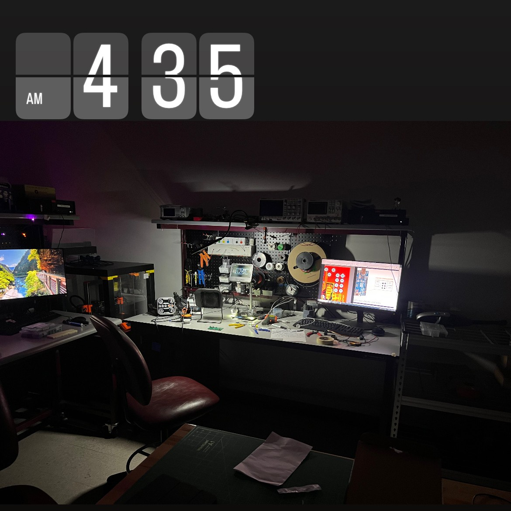

Goal: Learn about higher-powered digital electronics, and PCB design for integrated boards. This PCB was designed with my Atmega32U4 project in mind. 

**STATUS:** I hit a wall :/

<!--more-->

## Motivation
This was a spur-of-the-moment kind of project, because I wanted to batch order multiple PCB desgins from JLCPCB at once. Their PCBs are really cheap, but shipping from Hong Kong can be a bit expensive, so by ordering more at once, I save by only paying shipping once. 

At the time I was working on a project which shall for now remain nameless, but it would require using 4 stepper motors at the same time. I also wanted to use my Atmega32U4 devboard to control it, so I started designing with those things in mind. 

## Design

.png)

I chose the A4988 stepper motor controller as my driver only because I was aware of its existance in a lot of stepper-motor-controller breakout boards from Adafruit and other large electronics sellers. I also would not need a ton of torque/speed, so it seemed like a good, well-rounded, choice. 

The image above displays the first prototype design for the routing layout of each of the control signals for the chip. For each controller, there are 7 status inputs, as well as an 8th input for each step (typically used with PWM). As such, I turned to the IC that carried the Alarmclock project: the 74HC595 8-bit shift register, or a close cousin, the SN74LV595AR SMD. 

.png)

After tiling 4 units together, I added some capacitors, added some holes for my devboard, and added a few other features, and I was ready for manufacturing.

## Prototype
I got it manufactured, and struggled a little bit with soldering the IC's on, because of the thicker outer copper, but after preheating with my hot plate, and using the hot air gun to push the solder over the edge, I was able to make solid connections for my first prototype. 

I was reviewing the pcb design file in Altium when I took a closer look at the way I set up my shift registers, and realized that the first 
*and* second units were both connected to the same data in line (instead of being chained together in series). 
To fix this, I simply ignored the first slot, and only populated the 2  and 3 positions.

The morning of 2/6/25, I tried using it for the first time, in combination with the second revision of my AtMega32U4 devboard. 

I was unsucessful. 

I tried switching my microcontroller to my trusted Arduino Nano, but that didn't work either. 
I eventually called it a night, and left it for later.
As of 3/1/25, I have yet to make another attempt at getting it to work, and I can't quite say *why* it might've failed.

