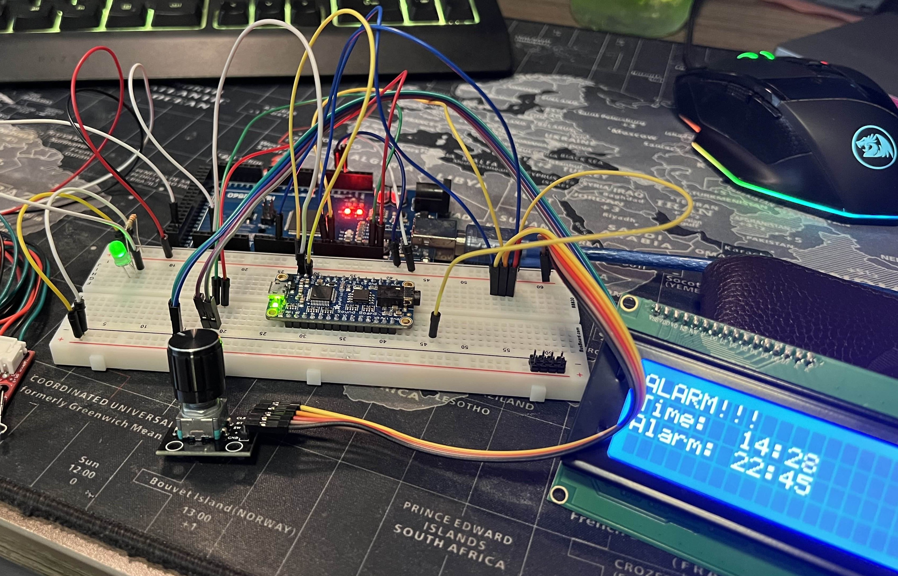

Goal: to learn about microcontroller integration & usage in electronics projects. 

To use an Arduino nano / ESP32 with a RTC module to create a functional alarm clock.

**Status:** Abandoned :( 
  
(I plan on coming back to this later)

<!--more-->

# Going forward
This project has seen a lot of development, during which I learned a **lot** about the things I wanted to learn about. 

I think that towards the end (right before abandoning it), I got very demotivated, as I was digging through the weeds of using a cheap ESP32 clone with the arduino IDE. I will revisit this project at some point once I finish learning how to embed my own microcontrollers into PCBs. 

I think I can make this project a lot smaller with multiplexing/charliplexing the LED array instead of driving them all at once. Or I can still drive them all at the same time, but use some SMD shift registers instead of the huge, clunky through hole ones. 

## Motivation
This project started because there were several times where my iPhone's alarm would not go off due to a software bug. I used this as an excuse to delve into digital electronics, and try my hand at fixing a problem using skills I had yet to develop. Up to this point, (1/5/23), I had very little experience with micro controllers, electronics design, etc. As such, I wanted to explore electronics a little bit more. 

## Design

As such, before comitting do buying anything, I spent some time in AutoDesk TinkerCAD, which is an online playground where I messed with the different components, to see what I could do. After a lot of messing around, I came up with a design that I liked, and a little bit of supporting code. Because there were so many moving parts, the simulation was brought down to single-digit FPS, but I knew that my idea may just work. 

## Physical Breadboard

From here, I bought myself an arduino nano, a few 74HC595 shift registers, a pcb soundboard, and a Real Time Clock (RTC) module from Adafruit. With these, I copied my TinkerCAD design onto the breadboard, and further customized it by adding a LCD screen and rotary encoder for navigation. 

## KiCAD PCB Design
Shortly after I figured out the breadboard layout, I started looking into PCB design, because I knew that breadboards were only meant for prototyping, and not for permanent solutions. My first try was with KiCAD, a free PCB Software. I only used it to make one design, which I never got manufactured. This design was bad *for a lot of reasons,* but it was a starting place. 

 
- Through-hole resistors take up a lot of space
- I was using TWO additional shift registers to manually trigger the soundboard, INSTEAD OF USING SERIAL (TX/RX) COMMUNICATION
- I, at that point, was just planning on using a 555 timer to use a PWM signal to control their brightness (instead of using a PWM pin on the nano to control the shift register's output enable pin)
- A lot of wasted space
- I used some component for a 7 segment display, instead of just dedicating a 5 pin pin-header to each side. This meant that I dedicated a lot of PCB space to the displays, without the intent of soldering them to the PCB (MORE wasted space)
- Probably a few more things


## ESP32 :(
While doing this, I, at some point, had discovered the ESP32. Advertised as a faster, more powerful microcontroller with built-in bluetooth and WIFI, I figured that nothing could go wrong by learning to use it by implementing it in this project. *Oh how wrong I was.* 

I went on Amazon and bought the *cheapest* ESP32 devboards I could find, which honestly was my main downfall, looking back. Anyhow, the Nano runs on 5V logic, whereras the ESP32 uses 3.3V logic, which means that all of my peripherals, built for 5V logic, would potentially fry the ESP32 board. This should have been my sign to just go back to the nano, but for some reason I *really* wanted to make it work. This being the case, I found some bi-directional logic level shifters on adafruit, which would allow my devices to safely connect to each other. 

Eventually though, after too much time was spent figuring out the different programming considerations, and learning about operating dual-core microcontrollers, forcing watchdog timers to behave, and a lot more, I finally got back to where I was with the Nano.

## Altium PCB Design

From here, I was finally ready to move to PCB desgin **AGAIN**... I got in contact with one of the Electrical Engineering professors at TAMU, and was able to get a student version of Altium Desginer. This software was a LOT more powerful, and I had heard it was used in the professional field. 

I cooked up a V1 design, put some funny silkscreen content in some of the empty spaces, left some extra pins broken out for the ESP & soundboard pins I didn't plan on using, and sent it off to JLCPCB for manufacturing. 

## Physical PCB

I made the mistake of not ordering a stencil, so I would have to add each of the SMD components by hand. I figured that I could just lay a blob of solder paste on each of the pads, and do a normal reflow... I learned that there's a reason you don't do that (it's easy to add too much solder). 

Thankfully, besides from looking *really* ugly, it functioned just fine. 

After putting in the rest of the through-hole components, I was ready for a first power on. To my relief, most of the functionalities worked as expected. **EXCEPT**, I could not get the soundboard, the LCD, or any other IC devices to detect or work. 

This was nice, but also a little disappointing. I tried manually soldering a bodge wire from the ESP32 pins to the pins of the LCD. Still to no avail.

# End

At this point, it was Summer of 2024, and my classes took up too much time, and prevented me from working on this. Later in the summer, I started working on the Atmega32U4, Battery Charger, and A4988 Projects. 

I would really like to attempt this project again someday, because I know that I can probably do it MUCH smaller and MUCH better. But until I find the time to, I will just leave it here.

And as for the original motivation behind this project, the original software bug was fixed, and I addressed the reasons that I was sleeping through alarms. 

<!--

-->
