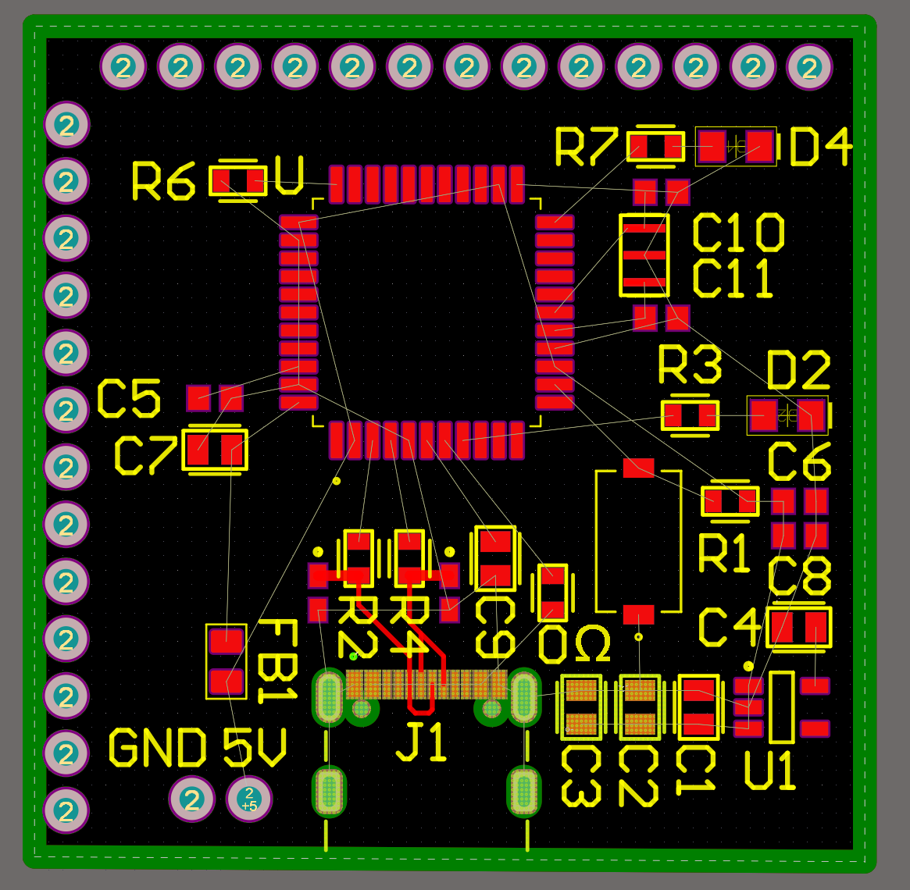
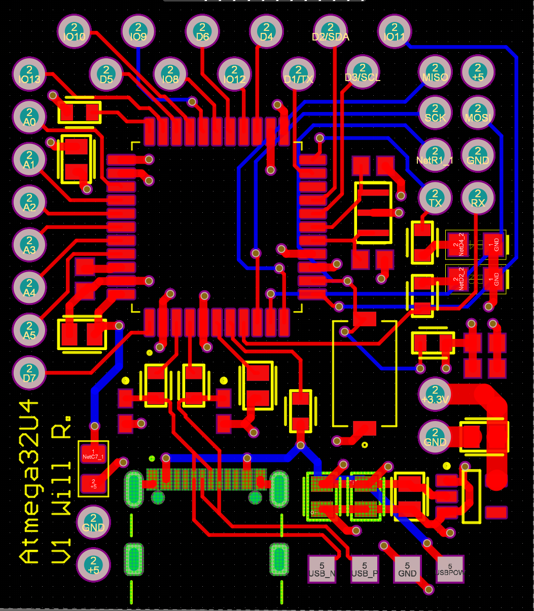
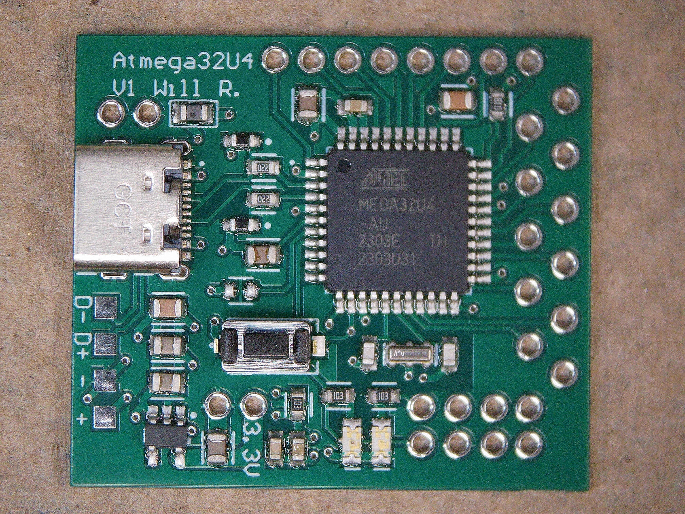
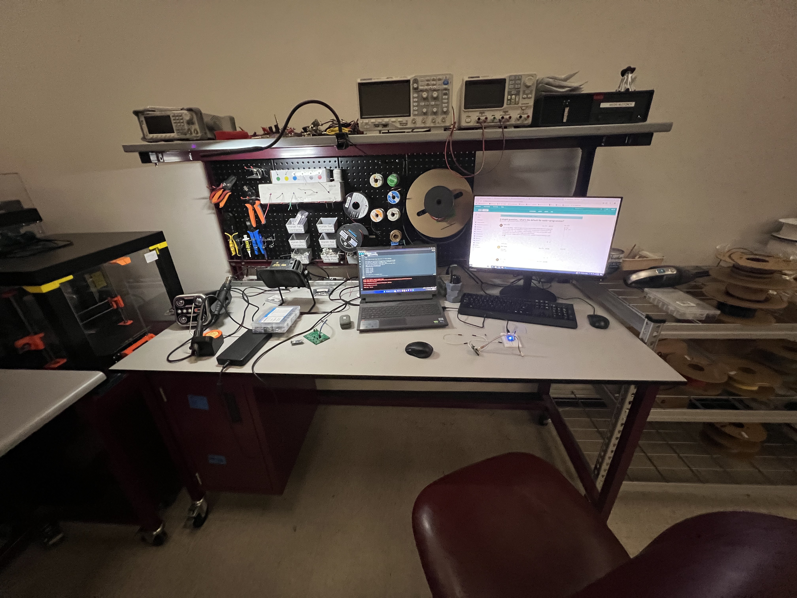
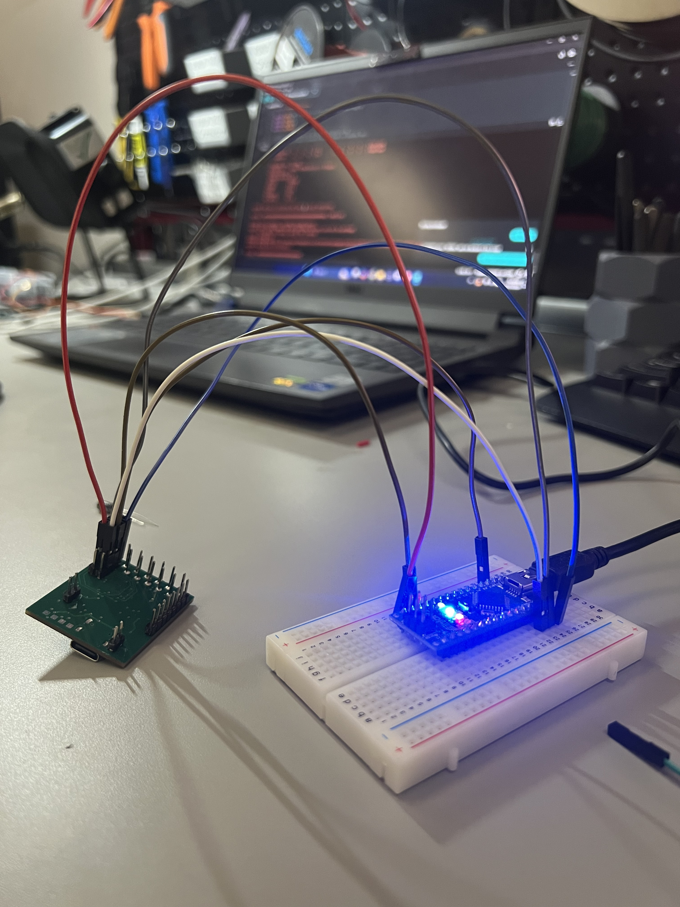
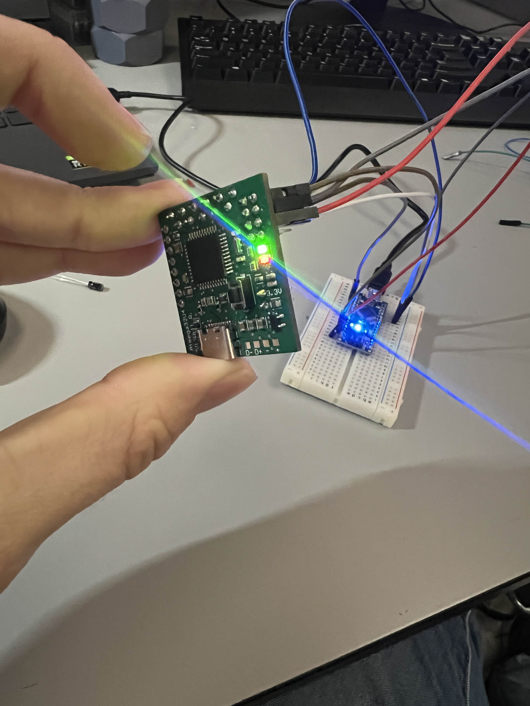
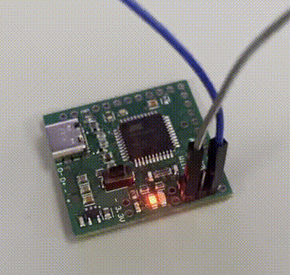
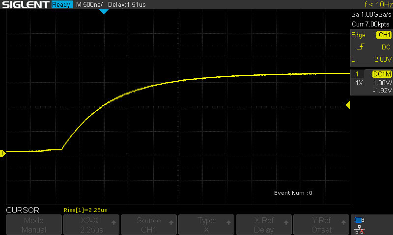

Goal:
To create my own microcontroller devboard based on the Atmega32U4

To learn about embedded systems, designing PCB for digital circuitry, 
and programming/debugging the board.

**STATUS:**  Work In Progress

<!--more-->

## Motivation 8/13/24
Mostly to experience the pitfalls of embedded systems. I know I can go out and buy an arduino Leonardo for about $25, but I have been curious about digital pcb design for a while, so I figured I would give it a try. The arduino project is also open source, which would give me plenty of resources, and examples to look at if I get stuck. 

This project is **heavily** inspired by [The Curious Scientist](https://bio.site/curiousscientist), so please check him out. I did not directly use any of his work, but he led me to the microcontroller used, the Atmega32U4, which is also found in the Arduino Leonardo. All other features were built by me. 

## The Design 9/24/24
All projects start somewhere, and the image below shows one of the first iterations of the pcb layout. It being a devboard, I only needed to make the μCU work, with very few additional features. 

I initially chose this design of having the pin headers in two perpendicular rows, but after considering the size of the actual chip, and how much wasted space there was on the board, I opted for a staggered design. This would condense the pins, allowing me to reduce the overall size. Additionally, I allotted 8 pins in a 2x4 configuration, 6 for In-Circuit-Serial-Programming (ICSP), and two more for TX/RX. (Ground & Power planes have been hidden, but are on the inner layers of this 4 layer board).

## First Prototype 11/7/24
I was happy with the design, so I sent it off to get manufactured, ordered my own components of DigiKey, spent about 2 hours assembling my first board, and verified that I could upload the bootloader to it. I excitedly made a post in [Starforge's Discord](https://www.starforgefoundry.com/), a local makerspace in college station, and was informed about a critical flaw in my USB-C implementation.

The flaw was that I left the CC pins floating, which meant that when I connected it to my computer, no connection was established. I couldn't program the board through the USB-C port. 

Luckily, I could still program via ICSP, it just required I keep the bundle of 6 wires attached anytime I wanted to upload a new program. This kept me going, and I continued on. I kept going, and was able to get some LEDs to blink, but I was growing frustrated with the awkwardness of the programming setup.

## Second Prototype 1/24/25

During this time as well, I took note of a few other changes I wanted to make, layout-wise, and edited my design in Altium. 
I was a bit more careful to make sure the pin spacings throughout the board would fit on a regular breadboard, and I changed the main IO layout from staggered to an inline position. I also added the pulldown resistors to the CC lines, and moved some components around to waste less space. In the image below, V1 is on the left, and V1.1 is on the right. 

After some shipping delays from Hong Kong due to current events, the V1.1 of my design arrived, and I put it together when I found some time. 

# **[INSERT IMAGE OF PHYSCIAL v1.1 PICTURE]**

After uploading the arduino Leonardo bootloader onto the chip, everything worked as expected! It's still a little bit awkward to use on a breadboard, because the board covers the entire width, but it will at least be secure. I also messed around with an oscilloscope to measure the transient behavior, to see the rise/fall times of the built-in RX LED. 

## Going forward

As of writing this (3/3/25), the semester has gotten busy again, and I'm shifting my priorities from working on summer plans rather than furthering my projects. So everything will be on hold while I finish documenting everything.

When I return, though, I think that this board is good enough to try again with the A4988 motor controller board. The behavior is less random, and I can easily upload new programs to try different things. For a V1.2, I think that I would like to reduce the board width by 0.1", enough to allow for it to not take up the whole width of the breadboard. To do this, I will likely have to trade shorter width for a longer height, since there aren't really any deadspaces left on the PCB. 

Unrelated, but here's another thing I made:

