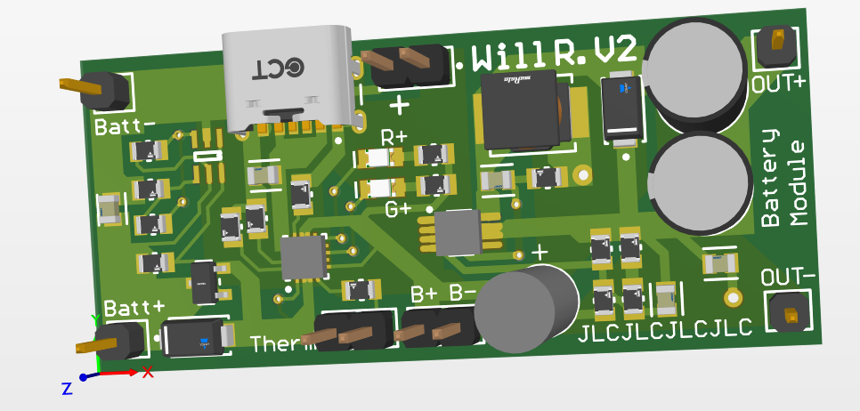

Goal: Build my own 18650 Lithium-ion interface for later projects. Functionalities should include battery regulation, standard safety features, and a boost converter able to provide 5/12V. Learn about simple battery management systems. 

**STATUS:** Back-Burner

<!--more-->

## Motivation 5/26/23
A friend of mine from high school obtained an E-bike, only to find that it was not working as expected. As such, my friend reached out to me, to see if we could figure out the problem, and restore the motor's functionality. In short, something in the Battery Management System (BMS) had broken, and I did not know enough at the time to be able to guide my friend to buying a new BMS. We split the cost for a new Battery Pack + BMS, in exchange that I could keep all the individual 18650 Cells. 

## More about the E-bike
 
After some initial chatting, we figured a good starting place would be to more thoroughly inspect the bike to see what may be causing the issue(s). In my garage, we spent a few hours taking apart the bike, during which time we were just exploring the components that made up the E-bike. From the battery, to the different control circuits, to the Electronic Speed Controller (ESC) for the motor. I jammed my multimeter probes into the terminals of the battery, and found that there was only a voltage of about 2V, as opposed to the expected voltage of 36V. 

Upon further disassembly, we found the spec sheet for the batteries and discovered that it was made up of 30 18650 cells (3 parallel groups of 10-in-series). We also found the Battery Management System (BMS), in charge of balancing voltages, and ensuring the batteries charge and discharge equally. 
 

## 18650 Cells 6/19/23
"18650" refers to the dimensions of the cell, in that it's 18mm in diameter, and 65mm in length. After all of the metal ribbon strips were cut, and the batteries were separated, I was left with 30 of these cells. As for storage, I decided that using cardboard was my best option, as it was non-conductive, provided its own bit of padding to each cell, and would prevent any of the batteries from completing any kind of electrical circuit. 

Some of the batteries were duct-taped down, because I had punctured the thin paper insulation on the (+) side, risking discharging. Most of them came out fine though, and from here I needed to find a way to regulate them before being able to use them in any projects.

## TP4056 Charger 2/27/24
I found some charging units off of AliExpress for super cheap, and thought I'd give them a try. They had a type-C charger, easy soldering ports for connecting external power input, the battery cell terminals, and a power output. The unit features over-discharge, over-voltage, and short circuit protection, as well as having 1000mA charging current, and up to 3A continuous output current. 

I also had to buy an external DC-DC boost converter in order to supply a steady 5/12V. This was not very elegant, requiring two boards to be flopping around, with a lot of wires between each of the parts. This is where I had my idea to combine the charing circuit and the boost converter into one PCB module. (Additionally, the boost converter had a trimpot for adjusting output voltage, but I would only ever need a constant 5/9/12V. I have *never* (yet) had a situation where a variable voltage is required)

## First PCB Design 7/8/24
I was motivated to make a PCB quickly, so that I could order multiple PCB designs at the same time (v2 of my alarmclock and this). I did a lot of research in very little time, and produced a V1 PCB design. Looking back, I really should have not rushed this stage, as I spent a lot of time later trying to figure out the problems with this design. 

After shipping, I threw together the first physical prototype, and started testing. After determining that there were no short circuits, I plugged a singular battery cell, and checked for any output power. After a little fiddling, I got 5V on output! 12V also worked, requiring a different resistor in the feedback part of the DC-DC boost converter circuit. I also tested charging, which worked, although it was a little inconvinient to do it from the power supply because I forgot to add seperate pins for 5V input power. 

Quarter for scale. The chemical structure is for Caffeine, that I drew in Notability. 

## Problems & Troubleshooting 7/22/24
That summer, I was taking summer classes, and my birthday (7/22) landed on a monday, so I had lectures :/

To treat myself, I spent the rest of the afternoon relaxing and tinkering with my project. In my element. About this time, I was having trouble with the board, specifically with the over-discharge protection. I, again, went to [Starforge's Discord](https://www.starforgefoundry.com/) to ask about the problems I was having, since I suspected it had to do with the MOSFET I had chosen. A diagram of my component layout is below, but in short, I had an OverVoltage (OV) / UnderVoltage (UV) monitor (TPS3700) spec'd to the voltage window I wanted monitoring the input (battery) voltage. If it was outside of that window, it was supposed to trigger an N-channel Enhancement MOSFET to disconnect the battery from the rest of the circuit. 

I would later realize that I had things switched around, and the MOSFET did nothing. Oops. 

## Second PCB Design 10/17/24
I got busy for the rest of the summer semester, and couldn't work on this project until the fall. At this point I had designed the first versions of the Atmega32U4 and A4988 boards, and remembered this project, and thought that I may as well make a 2nd revision of it while I was at it. So I whipped up a second version of the PCB, with what I *thought* was a fix to the protection circuit from V1. 

## More problems & Troubleshooting 1/24/25
I don't have any pictures yet, but I got a single board assembled, and I attempted to test it the same way I tested the V1 board, except there was a dead short somewhere, and it maxed the current limit of the power supply (I set it to only be 0.5A). Dead shorts are bad , so I need to figure out if it was a soldering issue, or a desgn issue, or something else. 

The only hint I have for why this is happening is that the main battery IC (BQ24074) is the one that is getting *really* hot. So hopefully it's simply just a solder bridge, rather than another design flaw. 

This is as far as I've gotten though. I haven't been super motivated about this project specifically. All of my time has been spent on the Atmega32U4 project as of recently. Eventually I will come back to this project though, and I will probably just solder together a 2nd board and see if it has the same issue. 

At some point I'd like to take some steps back and see how other people do Li-ion protection circuits. This was the first time I tried finding my own IC by research, rather than copying someone else, and I think it was informative, but not very practical. There being hundreds of thousands of similar options made it difficult for me to process all of the differences, so I picked an IC at semi-random (I was careful about the specs, but I chose to use Texas Instruments on a whim). 

There are definitely more practical ways to do what I want to do. 