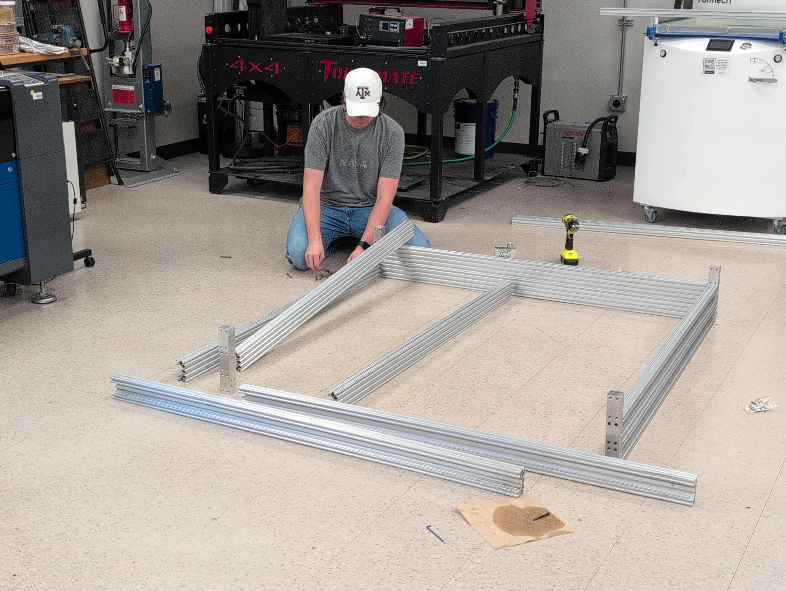
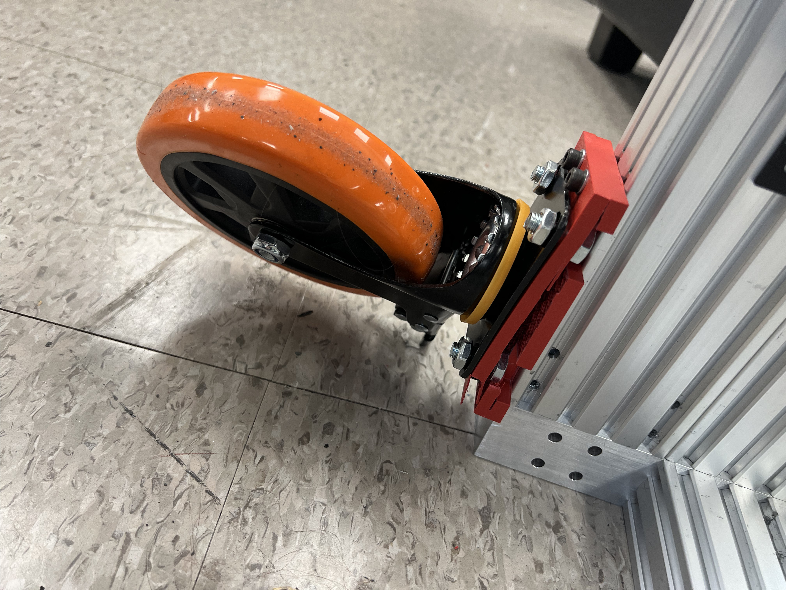
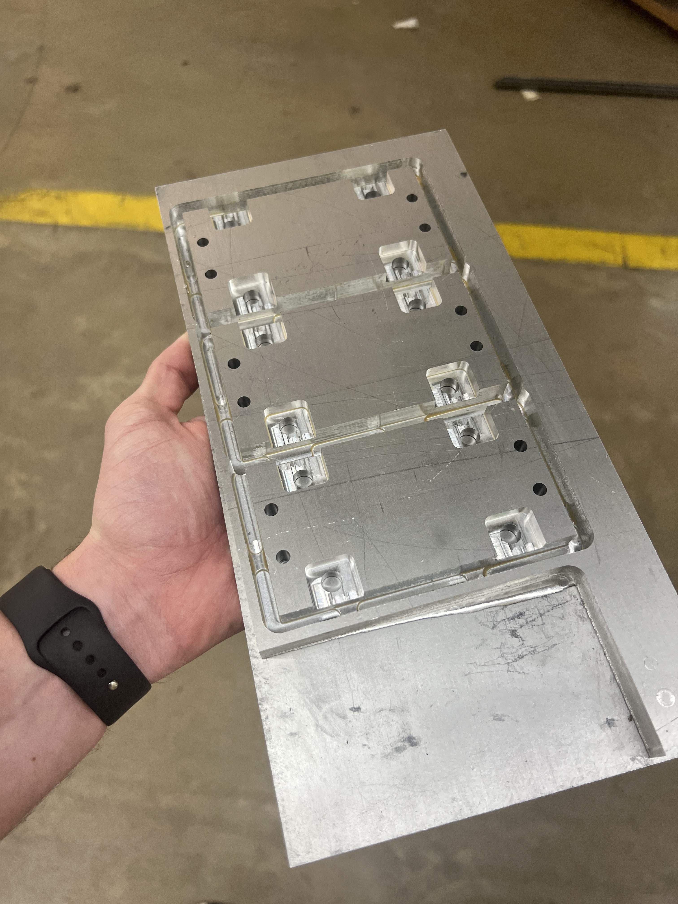
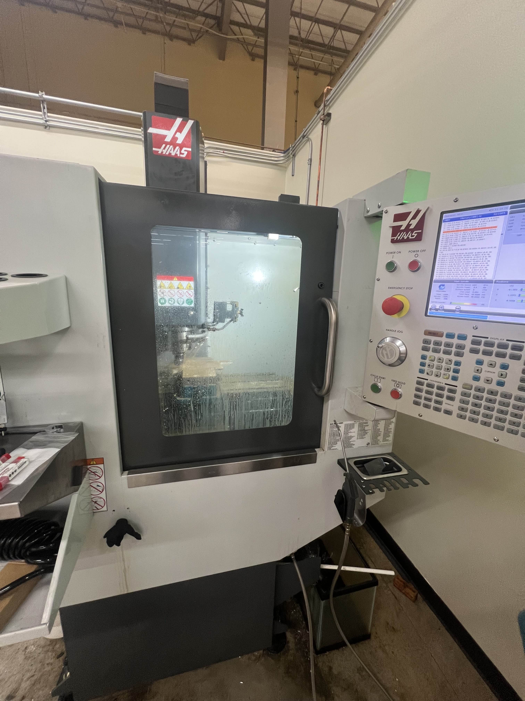
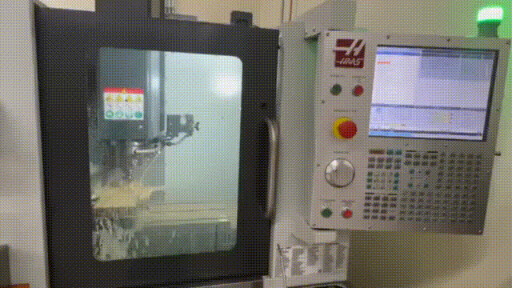
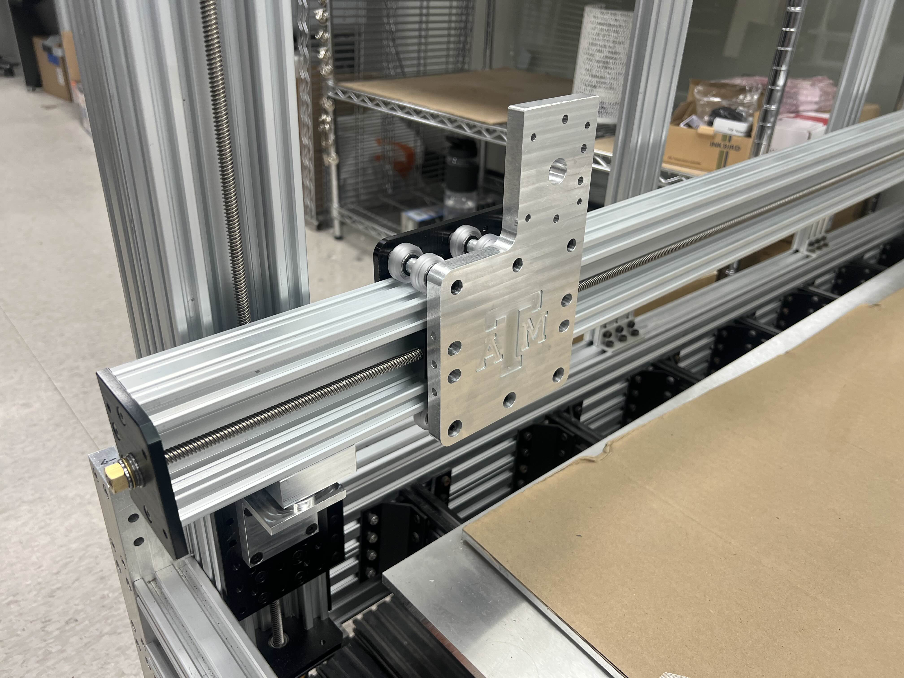
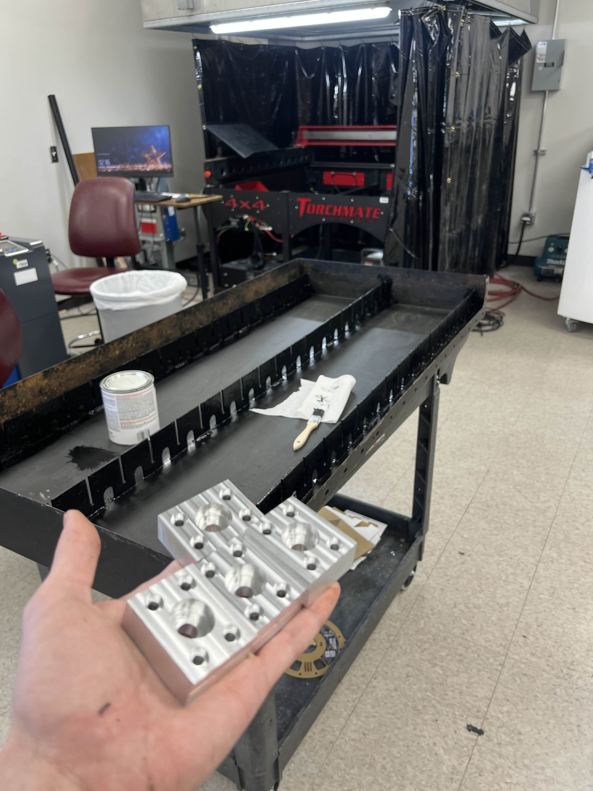
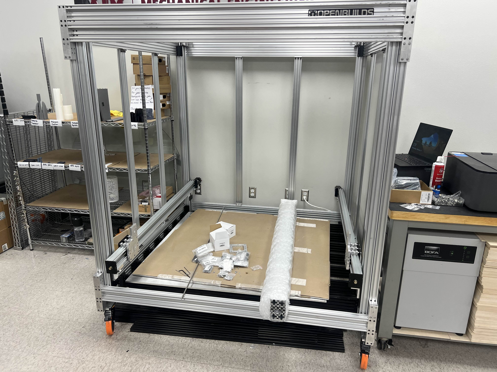

Adapting Dr. D Flo's Large Format 3D Printer (LF3DP) build for the RPS 

**STATUS:** Work in Progress

<!--more-->

Within the mechanical engineering departmnet, the Society of Automotive Engineers (SAE) has expressed interest in having the ability to 3D print *very* large objects like aerodynamic car shells (carbon fiber molds), or other demonstration pieces. Whatever the reasoning may be, my boss decided to embark on building a large format 3D printer, and ordered most of the parts required to make the frame, gantry, and bed. 

## Note
Unlike most of the projects listed here, this is *not* a personal project. This is something I am doing for my student job at the Rapid Prototyping Studio within the MEEN department of Texas A&M. As such, I am only obligated to work on this project while I'm on-shift, which is limited to about 10 hours per week because of class load. Therefore, don't be surprised if this project takes a lot longer to progress than normal. If I was working fulltime, progress would be a lot faster.

## Introduction
The LF3DP is a project by Dr D Flo, and we are using it as a base for the Large Format 3D Printer we are making at the RPS. By that, I mean that we are mostly using *his* design files, *his* CAD models, and *his* design choices (for the most part). There are some small changes that we made here and there, or some customizations, but this project would likely be inaccessible to the RPS if it weren't for him. (It'd take too long to design all the things ourselves)

As such, please check out his documentation for his project [here](https://www.drdflo.com/pages/Projects/LF3DP.html) if you are at all interested in reading more, or are curious about his other work. 

## Frame 10/24/24

This has been a low priority project, since even before the parts were ordered, the group wanting to use it changed their mind and pulled funding. My boss ordered the parts anyway, and they sat for about 3 months until we finally started building the base frame. 

We finished the frame, which turned into a rectangular prism. Some of the corner joints are made of solid aluminum, and were machined by our resident Machinist, Ubaldo. During the week right after finals, Jackson (one of my coworkers), and I stayed in College Station to work 1 week full-time to work on a lot of projects. 

During this time, we worked on projects like working on the plasma cutter (see its dedicated page), running a shop air-line throughout the space, and learning CNC machining. We wanted to add wheels to the built to facilitate easier locational adjustment, in the event that we rearrange. This needed an adapter plate, which I prototyped using our 3D printers, then later CNC'd out of solid 1/2" Aluminum plate once we got a design that worked. While switching them out we ended up breaking the plastic plates, showcasing the reason we were switching to solid metal. 

During this time, I had the pleasure of learning how to do CNC machining. Specifically, I learned how to use our Haas Super Mini Mill, located off campus using Fusion CAM. My consensus after doing this is that the idea of machining is *really* fun, but actually doing it is somewhat painful. Reason I say that is because I really enjoyed fiddling about with different toolpaths, and being able to see the part come to life in Fusion simulation, but then actually having to bother with getting the material secured in the vice, setting program zero, and doing all of the setup took a lot longer than I was expecting. 

Nonetheless, I thought it was fun, and I now have a new respect for machinists, who have to deal with all of this, all of the time. Once the semester started back up, I couldn't find time during the official 9am-5pm schedule to visit our off-campus location, so I couldn't do any more work on the big CNC machine. Our machinist was the one to manufacture the rest of the parts required for this build. 

## Gantry 1/24/25

After coming back from winter break, I starting working on the project some more. Progress was still slow, because at this time it **really** became a low priority, since I was also tasked with getting the plasma cutter online. Still, I was able to put the gantry together, consisting of the Y and X axes. This required some custom plates, that Dr D Flo embelished with a cool design, and so we took a similar direction, and I modeled the plate so that the classic A&M logo would be on it. 

The Z axes was put in place by either my boss, or my coworkers, and so all I had to do were screw in some machined brackets made by Ubaldo and call it a day for the Y axes (along with actually preparing each Y axis with a motor, lead screw, and end-plates). Shown below is one-half of the bracket for each of the 4 corners. 

Anyhow. As of writing this article (3/3/25), we have the Z-axis and Y-axes built, and assembled, with the X-axis ready to go on as well. We did hit a bit of a stopping point though, as we need to put thread-lock on all screws to prevent things from rattling apart, becasue that is already happening. 

Additionally, the amount of people using the RPS has blown up, it being the middle of the semester, which means that most of the other staff are all busy fixing printers or helping people. Meanwhile my only job at the RPS has been to get the plasma cutter online. 

I hope that things eventually cool down enough that we can start working on this project again, as I would really like to see it completed *before* I graduate. 

Unfortunately, I do not have a latest-picture of the build, showing the X-axis, but I have this one with the Y-axes attached!

