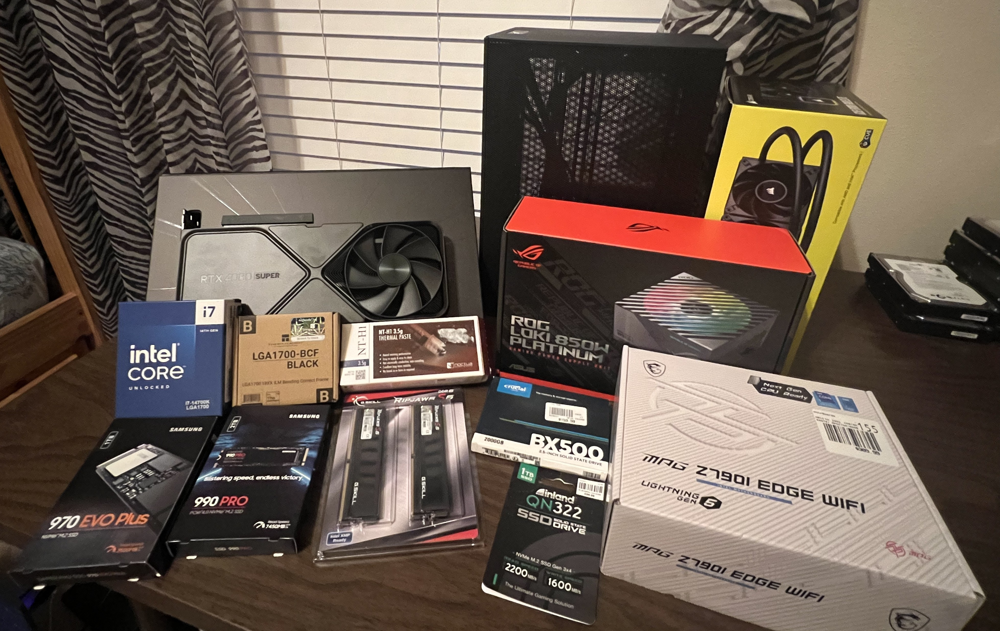

Custom building my own ITX desktop computer

**STATUS:** Complete!

<!--more-->
## Motivation:
My old computer broke. 

More specifically, I suspect that the motherboard was starting to give out for some reason. It would have intermittent issues where it would fail to load windows (entering BIOS) over and over again, or just fail to turn on entirely. 

I replaced the boot drive, CPU, RAM, and GPU with compatible alternatives from my family's other computers, but nothing ever solved the problem. I even went as far as to rebuild the whole computer in a new case, on the off-chance that something was wrong with the way it was currently built (this was a prebuilt computer from DigitalStorm). 

So all I really have as far as a conclusion is that the motherboard died somewhere, and that's a pretty reasonable conclusion since the computer was about 8 years old when it died.

Specs:
- Intel i7-9700K
- Nvidia GTX 1080 
- 32GB 3200 MT/s DDR4 RAM
- Total of 2 TB SSD Storage
- Total of 4.5 TB HDD Storage

To get through the rest of the semester, I relied on my laptop. Using the HDMI output, I connected to my computer monitor and made it work. 



## Planning
I had 2 goals that I would want to achieve in building my own computer. 
1. It would have to last a long time (>5 years) while still being okay
      - My previous computer lasted for around 6 years, from about 2017-2023. In the last 3 years of me using it, though, it starting showing signs of aging. When it was purchased, it had the top-of-the-line components, and I think that is the reason it held up so long performance-wise. 
2. It had to be on the compact side, and Anti-RGB
      - My old desktop had these persistant motherboard lights. In retrospect, I probably could have found some piece of software to turn them off, but even when the computer was shut down, the lights would stay on, forcing me to resort to turning off the power supply completely every time I went to bed. 
      - It also weighed a ton, and was massive. This made it inconvinient to have under my small desk, in my small apartment. There was a lot of empty, wasted space on the inside of the case, and looking into this led me to the ITX form-factor for building PCs. 

With this in mind, I started doing some research, and came across a content creator, Devyn Johnston. He primarily does a lot of small-form-factor computer building, and one of his [videos specifically](https://www.youtube.com/watch?v=d2IHcpCWndc) seemed to cross off every single requirement I had. The case it featured was the SSUPD Meshroom S V2 [(Amazon)](https://www.amazon.com/SSUPD-Meshroom-Mini-ITX-Small-Factor/dp/B0C5XNFCT4/), which has enough space to not be *super* limiting in my component choice, while being small enough to easily fit on my shelf. 

For ITX Computer builds, the case that everything goes in will affect the available parts that can be used. Under a certain size, every cubic inch starts to matter, and much more effort has to go into finding components that will fit, and cables that are flexible enough to handle narrow openings. The discovery of the Meshroom case solved largely solved this for me. 

With this, I set myself to buying the same tier-components from my old desktop, just from the newest generation. I also bought a 2TB SSD to start me off, eventually buying more storage as I needed it for backups, redundancy, and recordings. 

Specs:
- Intel i7-14700K
- Nvidia RTX 4080 Super
- 32GB 6000 MT/s DDR5 RAM
- Total of 9 TB SSD Storage

### The GPU
One problem I hadn't thoguht about was how I would actually get my hands on a GPU. There's an eternal shortage of GPUs due to the amount of scalpers there are (people who use bots to instantly buy all available GPUs, then resell them at a markup). 

In short, I got extremely lucky when I checked NVIDIA's website at like 2am & found that they had 4080 SUPERs available. I had previously talked to my dad about spending the money (to work out a way to pay him back as I earned money from my student job), and with that clearance I placed the order as soon as I could. 

A few weeks later & I had a new NVIDIA RTX 4080 Super Founders Edition arrive!

## The build
As for the actual build, the case came with a pretty huge (and a little hard to follow) guide on different configurations depending on GPU & CPU-cooler size. Once I found the right part of the guide, the guide was fairly thourough in explaining the build process, and I was able to get everything together in about 2 hours. The only problem at this point was that I did not do any cable management, and I had all sorts of power wires spilling all over the place. 

To put less pressure on the AIO liquid hoses, I switched the fans from a push to a pull configuration, and used some fan grills to prevent the cables from getting into the fan blades. 

## Add-ons
After building the computer for the first time, it really dawned on me that I can customize it exactly to my liking. As such, I went out and picked up a slim Noctua fan to put on the top of my PC to vent hot air out of the top. 

Additionally, I realized I could get as creative as I wanted with component placement to work around the size limitations. As such, and because I was having trouble finding room for one of the 2.5" SSDs, I decided to simply place it on the backside of the case. 

## The result
In the end, I completed all of my goals. The computer sits nicely on the shelf on top of my desk, the only source of LED lighting is from the iCue CPU cooler, which I can easily turn off, and the components are all extremely competent, and should last for years. 

