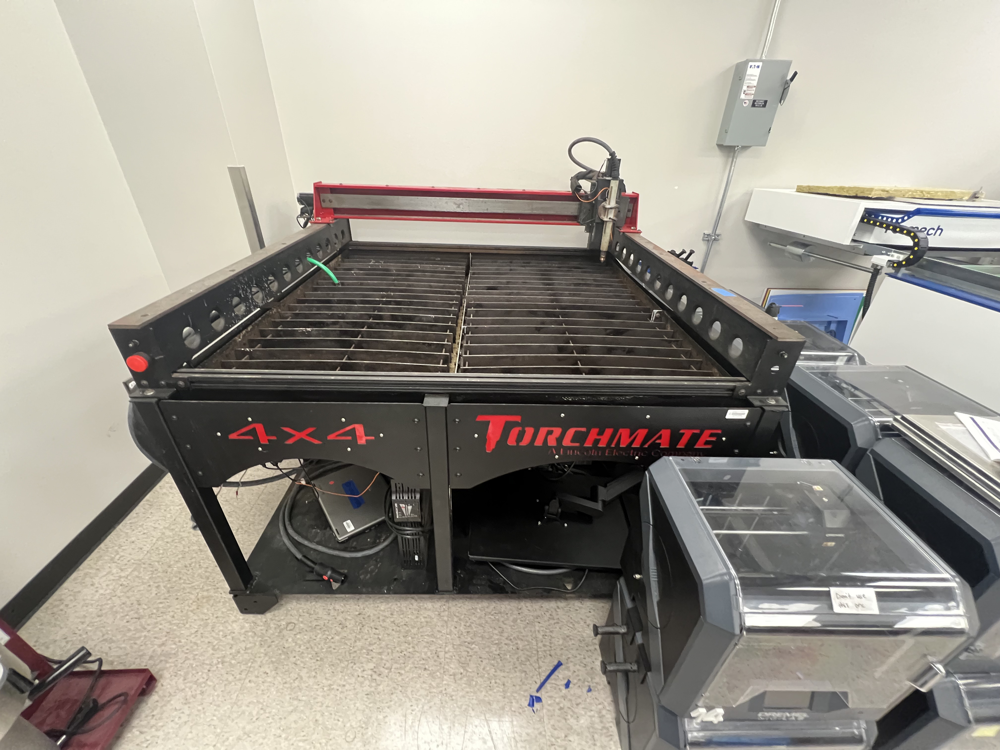
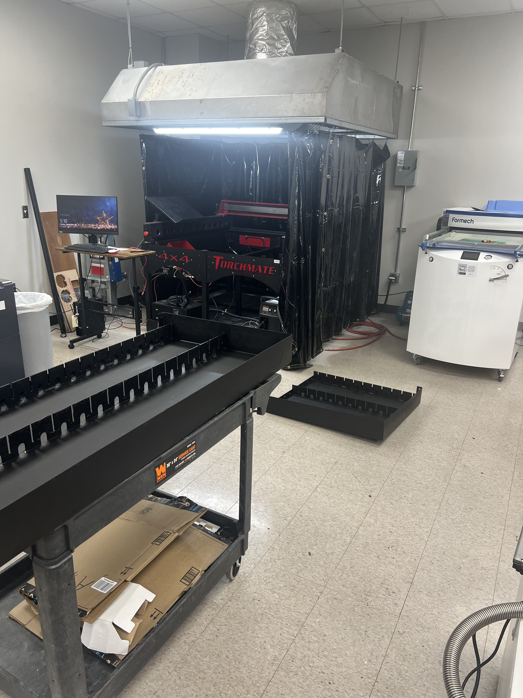
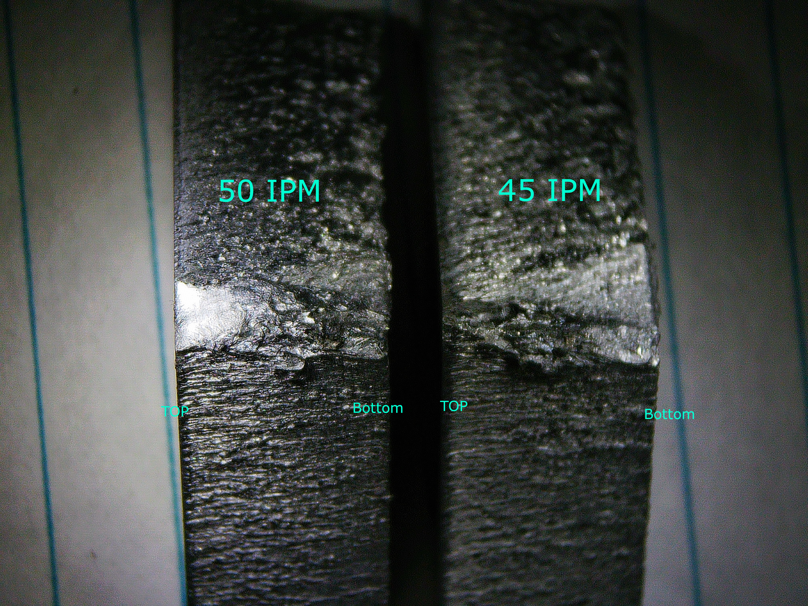
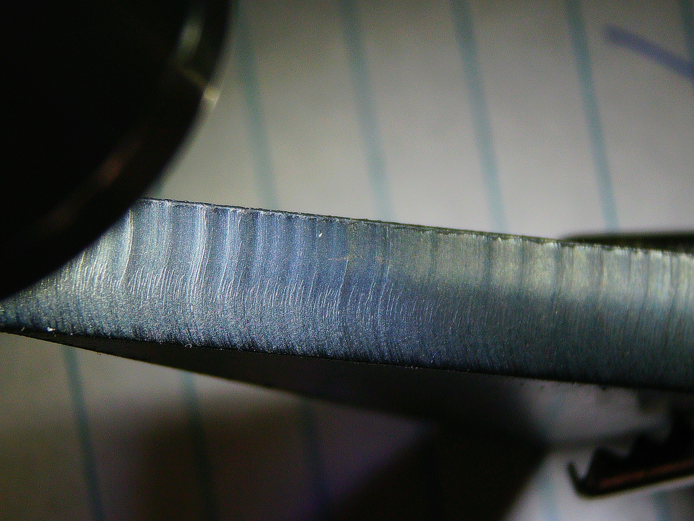

Resurrecting an abandoned Torchmate CNC Plasma Cutter for TAMU MEEN Dept.

Goal: Learn about, fix, and document the process of using a CNC plasma cutter for students & staff to use

**STATUS:** Build Complete! Still working on improvements

<!--more-->

Before undertaking this task, I knew next to nothing about plasma cutting. This endeavour required I become extremely familiar with the plasma cutting, and with our specific machine.

## Background 5/8/24

From what I understand of the story, some researchers within JCAIN (a building on-campus which houses a lot of research, classrooms, and the Rapid Prototyping Studio (RPS)(where I work)), had purchased a plasma cutter, not used it, then left it to sit in a room for about 5 years. Very recently, we moved the cutter up to the RPS on the 4th floor with the intention of adding it to our arsenal of Rapid Prototyping tools.

As of May 8th, we got the cutter moved up to our room, but there would still be a LOT of work required to get it up and running again. 

That summer, construction was done to essentially put a 2'x2' hole in the concrete ceiling, and install a large fan to act as an exhaust point for all of the hazardous gasses associated with plasma cutting. After the vent hood was eventually installed, it sat untouched *still* until much later in the semester (due to the RPS using a new system, and it requiring a lot of attention). 

## Real work 12/18/24
The week after the fall semester ended, in addition to working on the LF3DP, a lot of time was put into bringing the plasma cutter online. This started by recoating the waterbed in silicone to stop water from leaking everywhere. Additionally, a fire-retardant welding curtain was installed, and the Accumove 2 box (controls the motors & does the CNC part) was remotely reprogrammed by Torchmate. 

## Actually getting it working 1/31/25

Coming back from winter break, I made a laundry list of items that needed to be complete before we could safely run the plasma cutter. The exact contents of that list are unimportant, but largely covered machine inspections, fixing the wiring mistakes of the previous owners, and figuring out the control software, to name a few. 

By Jan 31st, 2025, all of these items had been completed, and **I** got to be the first one to run a test cut on our now-functional plasma cutter! It was from a thin piece of questionable steel (about 24GA thick). It was really poor quality, but everything worked as expected, and it didn't blow up! 

Since then, we starting running more and more test cuts, starting with some 12GA Stainless steel, then 3/8" Aluminum, then 1/4" Mild steel, and as the days go on, the list of materials we've cut grows and grows. 

After learning a *lot* about plasma cutting, I wrote a Standard Operating Procedure Document for our plasma cutter. In total it contains nearly 30 pages of detailed instructions about how to go about using the plasma cutter, and a lot of background info. Soon as well, I will be creating a video tutorial specific for our plasma cutter setup. 

In retrospect, plasma cutters are pretty normal to have around in machine shops, but it was a really fun and novel process to learn how to do it all by myself, just digging through hundreds of pages of operators manuals, and outdated online video tutorials. It's a good feeling to know that I'm the expert at using the plasma cutter, and it's rewarding to teach my coworkers about using this machine. 

## Cutting!
Below is a compilation of cut side profiles, and GIFs of the plasma cutter working. 

3/8" Aluminum Side Profile
 
The reason this is so bad is partly because we're using regular air, instead of Nitrogen, or some other inert gas. The presence of oxygen quickly oxidizes the aluminum, forming aluminum oxide, which has a higher melting temperature as compared to pure aluminum. Also Aluminum is just kind of a bad material to cut. 
 

1/4" Mild Steel Side Profile

Small rectangular cut in stainless steel for a student


Large rectangular cut in stainless steel for a student


2 Passes cutting 1/32" Aluminum. The second pass happens right on top of one of the steel slats, causing extra sparks to fly off


## Next steps 
So the plasma cutter is fully operational, and this semester (Spring, 2025), I have been tasked with running parts for students, and teaching the other staff members in the RPS about using it as well. We are not ready to train students on using it yet, and I tenatively plan on eventually making a video guide for both using the software, then for actually using the plasma cutter. 